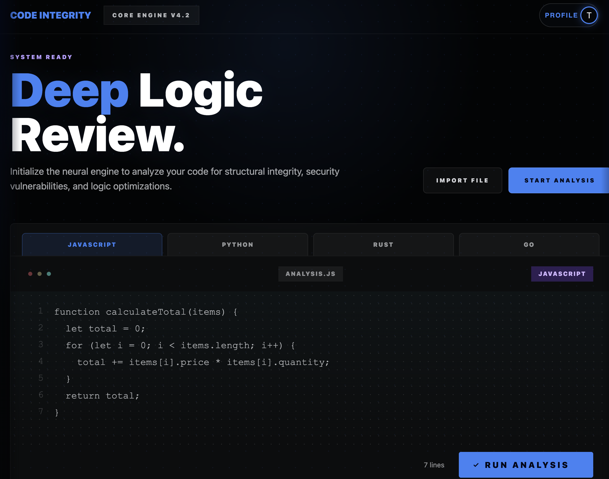
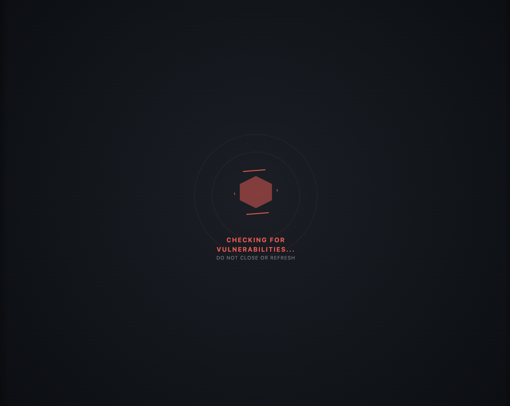
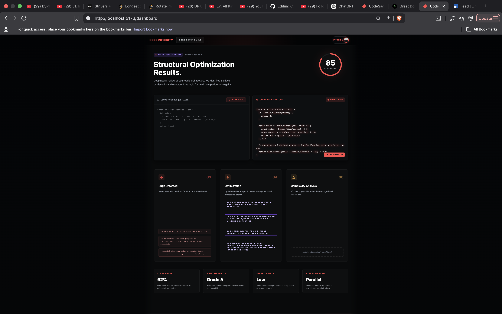

# ◊ CodeSage — AI Code Intelligence Engine

<p align="center">
  
</p>

<h2 align="center">Deep Logic. Real Intelligence.</h2>

<p align="center">
  <b>Scan • Refactor • Optimize</b><br/>
  AI-powered code analysis built for developers who care about architecture.
</p>

<p align="center">
  <a href="https://www.codesage.tech">
    
  </a>
  &nbsp;&nbsp;
  <a href="https://github.com/pankajkashp/CodeReview">
    
  </a>
</p>

---

## ⚡ What is CodeSage?

CodeSage is not another syntax checker.

It is an **AI-powered architecture review engine** that analyzes your code for:
- structural flaws
- hidden inefficiencies
- real-world performance issues

> Built to think like a senior engineer — not a linter.

---

## 🔥 Product Showcase

### 🧠 Landing Experience
<p align="center">
  
</p>

---

### ⚡ Code Analysis Dashboard
<p align="center">
  
</p>

---

### 🔍 AI Processing State
<p align="center">
  
</p>

---

### 📊 Final Optimization Results
<p align="center">
  
</p>

---

## 🧠 Core Capabilities

### 🔴 Deep Logic Analysis
- Detects architectural issues (not just syntax)
- Identifies performance bottlenecks
- Finds hidden bugs & edge cases

---

### ⚡ AI Refactoring Engine
- Generates optimized code instantly
- Cleaner, safer, production-ready logic
- Improves readability + maintainability

---

### 📊 Intelligence Dashboard
- Code score (0–100)
- Bug detection count
- Optimization insights
- Execution flow analysis

---

### 📂 Multi-Input System
- Paste code
- Upload files
- Session history tracking

---

### 🔐 Authentication System
- Supabase-powered login
- User-specific analysis history

---

### 📄 Export Reports
- Professional PDF audit reports
- Shareable analysis outputs

---

## 🎨 Design Philosophy — *Crimson & Carbon*

> Not built like a website — built like a **command center**

- 🔴 Primary: `#ff4d4d`
- ⚫ Background: `#05070a`
- ✨ Effects:
  - Glassmorphism UI
  - Neon glow system
  - Motion-based transitions
  - Infinite data streams

---

## ⚙️ Tech Stack

| Layer        | Tech |
|-------------|-----|
| Frontend     | React + Vite |
| Backend      | Node.js |
| AI Engine    | Google Gemini |
| Auth & DB    | Supabase |
| Styling      | Custom CSS (Cinematic UI) |
=======
# 🛡️ CodeSage — AI Code Review Tool

<p align="center">
  
</p>

> **Redefining code integrity through autonomous neural analysis and structural refactoring.**

CodeSage is a premium, high-performance **AI Code Review Tool** designed to analyze, refactor, and optimize source code with surgical precision. Built with a minimalist "Crimson & Carbon" aesthetic, it combines deep learning models with advanced static analysis to identify vulnerabilities, improve complexity, and enhance overall code quality.
---

## ⚡ Key Features

- **Neural Code Scanning**: Deep analysis of logic intent using advanced AI models.
- **Complexity Delta**: Visualizes "Before vs After" improvements in Time and Space complexity.
- **Structural Refactoring**: Generates optimized, production-ready code replacements.
- **Live Intelligence Bar**: Real-time feedback on engine status and neural core synchronization.
- **Interactive History**: Track and manage past reviews through an intuitive history dashboard.
- **About Mission Control**: A dedicated transparency layer explaining the inner workings of the AI engine.

---

## 🛠️ Technology Stack

| Layer | Technology |
| :--- | :--- |
| **Frontend** | React.js, Vite |
| **Styling** | Vanilla CSS (Crimson & Carbon Design System) |
| **Backend** | Node.js, Express |
| **Intelligence** | Google Gemini AI Engine |
| **Database/Auth** | Supabase |
| **Icons/Vectors** | Lucide & Custom SVG Architecture |

---

## 🚀 Getting Started

### 1. Clone
```bash
git clone https://github.com/pankajkashp/CodeReview.git
cd CodeReview
=======
### Prerequisites
- Node.js (v18+)
- Supabase Account
- Gemini API Key

### Installation

1. **Clone the Repository**
   ```bash
   git clone https://github.com/pankajkashp/CodeReview.git
   cd CodeReview
   ```

2. **Install Dependencies**
   ```bash
   npm install
   ```

3. **Configure Environment**
   Create a `.env` file in the root directory:
   ```env
   VITE_SUPABASE_URL=your_supabase_url
   VITE_SUPABASE_ANON_KEY=your_supabase_key
   GEMINI_API_KEY=your_gemini_api_key
   ```

4. **Launch the Engine**
   ```bash
   # Start the AI Server
   npm run server

   # Start the Frontend
   npm run dev
   ```

---

## 📂 Project Structure

```text
├── src/
│   ├── components/      # UI Components (Analytics, Engine, Profile)
│   ├── styles/          # Design System (Crimson & Carbon)
│   ├── App.jsx          # Core Routing Logic
│   └── main.jsx         # App Entry Point
├── reviewService.js     # AI Logic & Prompt Engineering
├── server.js            # Express AI Gateway
└── docs/                # Project Documentation & Assets
```

---

## 🛡️ License
Copyright © 2026 CodeSage. All rights reserved.
Built for the next generation of code integrity.

---

> [!TIP]
> To maintain high performance, screenshots are stored in the `docs/images` folder. This keeps them out of the production build while remaining accessible for documentation.
