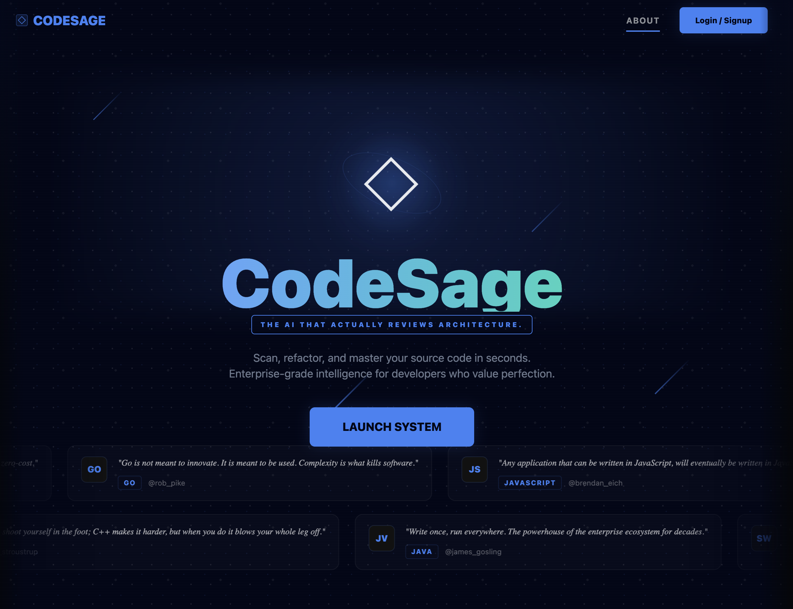

# ◊ CodeSage | Crimson & Carbon

<p align="center">
  
</p>

<h2 align="center">AI-Powered Code Intelligence Engine</h2>

<p align="center">
  <b>Scan. Refactor. Optimize.</b><br/>
  Enterprise-grade code review for developers who value perfection.
</p>

---

## 🔥 Live Product Preview

### 🧠 Landing Experience


---

### ⚡ Code Analysis Engine


---

### 🔍 Processing State (AI Engine Running)


---

### 📊 Structural Optimization Results


---

## 🛠 Features

### 🔴 Deep Logic Analysis
- AI scans code for structural flaws
- Detects inefficiencies & hidden bugs

### ⚡ AI Refactoring Engine
- One-click improved code generation
- Clean, optimized, production-ready output

### 📂 Multi Input System
- Paste code
- Upload files
- Track previous sessions

### 📊 Visual Intelligence Dashboard
- Code score (0–100)
- Bug detection
- Optimization insights
- Execution flow analysis

### 📄 Export System
- Generate professional audit reports

### 🔐 Authentication Layer
- Supabase-powered login system
- Secure user sessions & history

---

## 🎨 Design Philosophy — *Crimson & Carbon*

> Built like a **developer command center**, not a basic web app.

- 🔴 Primary: `#ff4d4d`
- ⚫ Background: `#05070a`
- 💡 Style:
  - Glassmorphism UI
  - Neon glow accents
  - Motion-based interactions
  - Infinite marquee data streams

---

## ⚙️ Tech Stack

| Layer        | Tech |
|-------------|-----|
| Frontend     | React + Vite |
| Backend      | Node.js |
| AI Engine    | Google Gemini |
| Auth & DB    | Supabase |
| Styling      | Custom CSS (Glass + Motion UI) |

---

## 🚀 Getting Started

### 1. Clone Project
```bash
git clone https://github.com/pankajkashp/CodeReview.git
cd CodeReview
