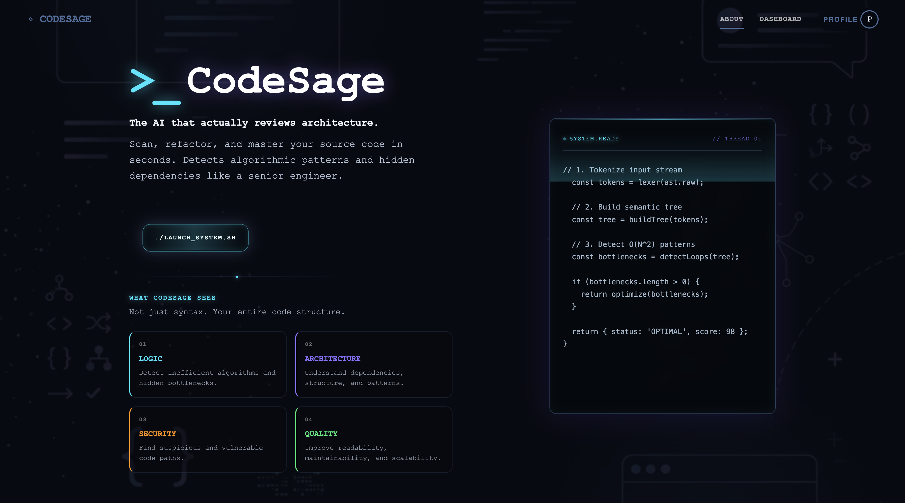
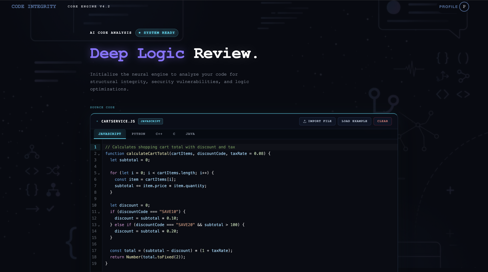
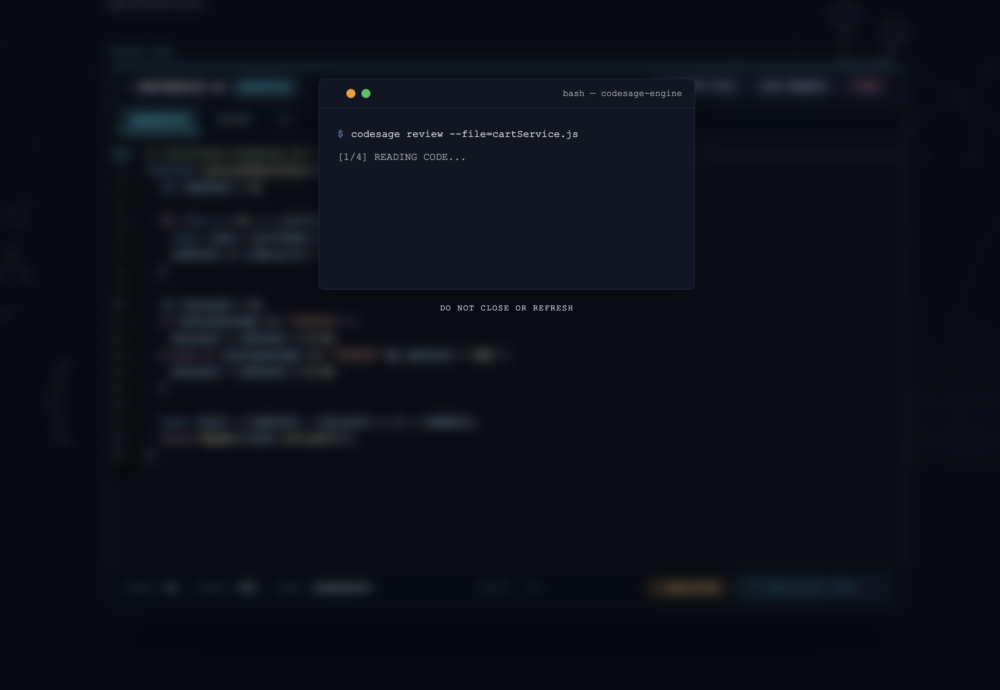
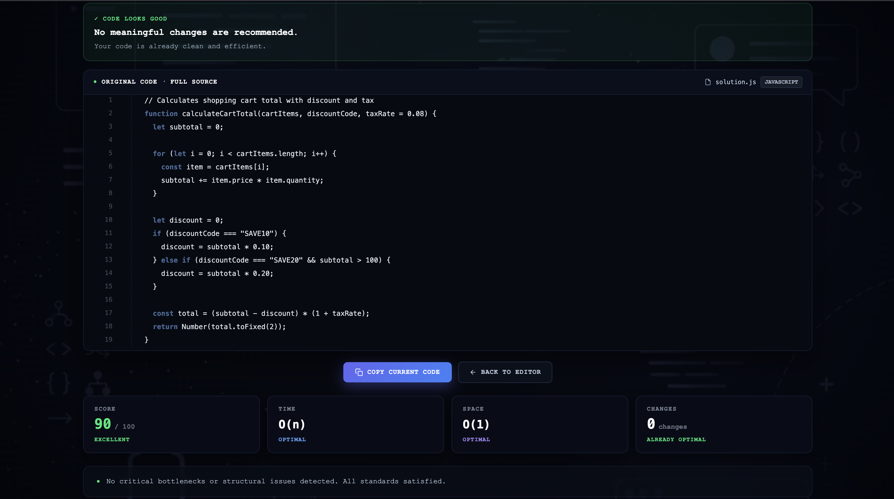

# ◊ CodeSage — AI Code Intelligence Engine

<p align="center">
  
</p>

<h2 align="center">Understand your code. See the change. Ship the better version.</h2>

<p align="center">
  <b>Paste → Analyze → Understand → Improve</b><br/>
  AI-powered code review focused on logic, performance, bugs, edge cases, and meaningful improvements.
</p>

<p align="center">
  <a href="https://www.codesage.tech"></a>
  &nbsp;
  <a href="https://github.com/pankajkashp/CodeReview"></a>
</p>

---

## ⚡ What is CodeSage?

CodeSage is an AI-powered developer tool that reviews real-world source code and explains **what should change, exactly where it should change, and why**.

It is designed around one principle:

> **Make the smallest meaningful improvement — don't rewrite good code just to make it different.**

Instead of behaving like a basic syntax checker, CodeSage focuses on:
- Logic and structural problems
- Performance bottlenecks
- Bugs and edge cases
- Time and space complexity
- Targeted code improvements
- Clear before/after explanations

---

## 🔄 How It Works

```text
PASTE / IMPORT CODE
        ↓
   AI CODE REVIEW
        ↓
 SCORE + FINDINGS + COMPLEXITY
        ↓
 ORIGINAL CODE  ↔  IMPROVED CODE
        ↓
 RED / GREEN CHANGE HIGHLIGHTS
        ↓
 COPY COMPLETE CORRECTED FILE
```

The review result shows the **full original source and full improved source**, while highlighting only the lines that actually changed. If no meaningful improvement is needed, CodeSage clearly reports that the code is already in good shape instead of inventing a rewrite.

---

## 🔥 Product Showcase

> Screenshots below are the current documentation assets in the repository. Replace them with the latest production screenshots whenever the UI changes.

### 🏠 Landing Experience
<p align="center">
  
</p>

### 💻 Code Review Dashboard
<p align="center">
  
</p>

### 🧠 AI Analysis Processing
<p align="center">
  
</p>

### 📊 Review Results — Full Code Comparison
<p align="center">
  
</p>

---

## ✨ Core Features

### 🔍 Full-File Code Review
- Original and improved source shown side-by-side
- Complete files remain readable
- Changed lines are highlighted rather than hiding the rest of the code
- Red/green visual diff for removed/changed and added/improved lines
- Line numbers and syntax highlighting

### ⚡ Meaningful AI Improvements
- Detects real performance bottlenecks
- Identifies bugs and edge cases
- Suggests algorithmic improvements when justified
- Avoids rewriting code that is already correct
- Preserves the user's original code exactly

### 📈 Review Intelligence
- Overall code score
- Time complexity comparison
- Space complexity comparison
- Key findings with line ranges
- Why a change is needed
- Why the improved approach is better
- Strengths and edge-case analysis

### 🧑‍💻 Developer-Friendly Editor
- CodeMirror-based editor
- JavaScript, Python, C++, C, and Java support
- Paste code without automatic reformatting
- Import source files with automatic language detection
- Load realistic application-code examples
- Internal scrolling for large files
- Responsive desktop/mobile layout

### 📋 Practical Review Actions
- Copy the **complete improved source file**
- Copy current source when no improvement is required
- Return to the editor without losing code
- Inspect previous reviews from history

### 🔐 Authentication & History
- Supabase authentication
- User-specific review history
- Protected review API with JWT verification
- Review history persistence isolated from the AI review result
- Storage policies for profile/avatar updates

---

## 🚀 Reliability & Performance

The review pipeline has been optimized to avoid unnecessary requests and artificial waiting:

- One primary Gemini request for normal reviews
- Controlled fallback for transient AI failures
- No fake/simulated review results
- No paste cooldown
- No artificial analysis cooldown
- Server-side request timing diagnostics
- Structured API errors
- Request payload limits
- Authenticated API access
- Non-blocking Supabase history persistence
- Fast `/api/health` endpoint
- Route-level frontend code splitting
- Vendor chunking for CodeMirror, Supabase, React, GSAP, and router dependencies

> AI generation time is the main variable part of review latency; the application avoids adding unnecessary processing around the model request.

---

## 🎨 Design Philosophy — Crimson & Carbon

CodeSage uses a cinematic developer-tool aesthetic designed to feel closer to a command center than a traditional SaaS dashboard.

- 🔴 Primary accent: `#ff4d4d`
- ⚫ Carbon background: `#05070a`
- Glassmorphism panels
- Subtle circuit/background artwork
- Neon accents and controlled glow
- Monospace developer typography
- Compact information hierarchy
- Responsive layouts

---

## 🛠️ Tech Stack

| Layer | Technology |
| --- | --- |
| Frontend | React 19 + Vite 7 |
| Routing | React Router DOM |
| Editor | CodeMirror |
| Styling | Custom CSS |
| Backend | Node.js + Express |
| AI | Google Gemini / `@google/generative-ai` |
| Authentication | Supabase Auth |
| Database | Supabase PostgreSQL |
| Storage | Supabase Storage |
| Animation | GSAP |
| Deployment | Vercel |

---

## 📂 Project Structure

```text
CodeReview/
├── api/
│   └── review.js                 # Production serverless review API
├── src/
│   ├── components/
│   │   ├── analysis/             # Analytics, diff and review result UI
│   │   ├── dashboard/            # Code editor / review workspace
│   │   ├── layout/               # Navigation and landing UI
│   │   └── shared/               # Shared UI components
│   ├── pages/                    # Login, profile, confirmation, etc.
│   ├── lib/                      # Supabase/auth helpers
│   ├── styles/                   # Application styles
│   ├── App.jsx                   # Routing and auth lifecycle
│   └── main.jsx                  # Application entry point
├── reviewService.js               # Gemini review logic + schema/prompt
├── server.js                      # Local Express development runner
├── setup-supabase.sql             # Supabase tables/RLS/storage policies
├── vercel.json                    # Vercel routing configuration
└── screenshots/                   # README/product screenshots
```

---

## 🚀 Getting Started

### Prerequisites

- Node.js 18+
- Supabase project
- Google Gemini API key

### 1. Clone

```bash
git clone https://github.com/pankajkashp/CodeReview.git
cd CodeReview
```

### 2. Install

```bash
npm install
```

### 3. Configure environment

Create `.env` locally:

```env
VITE_SUPABASE_URL=your_supabase_url
VITE_SUPABASE_ANON_KEY=your_supabase_anon_key
GEMINI_API_KEY=your_gemini_api_key
```

Never commit real API keys or secrets.

### 4. Run locally

Terminal 1:

```bash
npm run server
```

Terminal 2:

```bash
npm run dev
```

Open the Vite URL shown in the terminal.

### 5. Production build

```bash
npm run build
```

---

## 🧪 Verification

The project has been iteratively verified across:

- Gemini review success/failure paths
- Optimal code with no unnecessary rewrite
- Brute-force → optimized algorithm changes
- Full-file diff rendering
- Red/green changed-line highlighting
- Accurate changed-line counts
- Paste preservation
- File import and language detection
- Authentication/session restoration
- Supabase persistence failure isolation
- API authentication and rate limiting
- Responsive editor and review layouts
- Route-level code splitting
- Production build validation

The current development workflow is intentionally focused on **real-world code**, not only competitive-programming/LeetCode snippets.

---

## 🌐 Live Demo

**CodeSage:** https://www.codesage.tech

**Repository:** https://github.com/pankajkashp/CodeReview

---

## 🛡️ License

Copyright © 2026 CodeSage. All rights reserved.

Built for developers who want to understand **what changed, why it changed, and whether it actually needed to change.**
